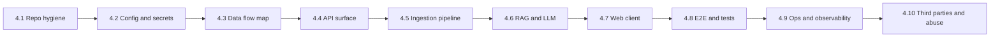

# DealScannr — Full Codebase Audit Playbook

This document is a **repeatable, end-to-end audit guide** for the DealScannr repository. Use it for security reviews, architecture reviews, pre-release checks, onboarding senior engineers, or investor / diligence technical questions.

**Repo shape (baseline):**

| Area | Path | Stack (typical) |
|------|------|-----------------|
| API | `packages/api` | FastAPI, Uvicorn, Python 3.11+ |
| RAG | `packages/rag` | Retrieval + synthesis pipeline, Groq / optional OpenAI embeddings |
| Ingestion | `packages/ingestion` | CLI: public web snapshot → chunk → OpenAI embed → Qdrant upsert |
| Web | `packages/web` | React 19, Vite, Tailwind, TanStack Query, Zustand |
| E2E | `e2e/` | pytest (API), Playwright (web) |
| Docs | repo root | `README.md`, `DEALSCANNR_*.md`, `TRACKER_TODO.md` |
| Infra | `docker compose` (per README) | MongoDB, Redis, Qdrant |

**Indexed RAG vs live RAG:** The **API request path** can use Qdrant + live context without running ingestion. The **ingestion path** is a separate operator/CI flow (`scripts/ingest.sh` / `python -m ingestion`) that **writes** vectors into Qdrant so retrieval returns `raw_chunks_count > 0` for a company. Auditors must treat these as **two halves of one system** (same collection / slug conventions, different trust and scheduling assumptions).

---

## 1. Why we audit (objectives)

An audit should answer, with evidence:

1. **Correctness** — Does the product behavior match documented intent (scan → report, optional vector + live context **and/or** pre-ingested Qdrant chunks)?
2. **Safety** — Are secrets, user data, and third-party calls handled responsibly **including batch embedding and bulk Qdrant writes**?
3. **Reliability** — What fails when dependencies (Groq, Qdrant, DuckDuckGo, Firecrawl, **OpenAI embeddings**) are down or misconfigured?
4. **Maintainability** — Can a new engineer trace **(a)** UI → API → RAG → externals **and (b)** CLI ingestion → `live_context` / Firecrawl → embed → Qdrant?
5. **Compliance posture** — For an “investor intelligence” product: attribution, disclaimers, data retention, and abuse resistance (even if informal at MVP stage).

**Non-goals:** This playbook does not replace legal review or a formal penetration test; it **feeds** those with a structured findings list.

---

## 2. Roles, timeboxing, and outputs

### 2.1 Suggested roles

| Role | Focus |
|------|--------|
| **Lead auditor** | Scope, severity rubric, final report |
| **Backend** | `packages/api`, `packages/rag`, `packages/ingestion`, Python deps, env, middleware |
| **Frontend** | `packages/web`, XSS/CSP assumptions, API client, state |
| **DevOps / SRE** | Docker, ports, secrets, logging, deploy story, **Qdrant durability / backups** |
| **ML / RAG** | Prompts, retrieval, grounding, eval hooks |
| **Data / ingestion** | Chunking, embedding model version, collection schema, **slug parity with API**, idempotent upserts |

One person can wear multiple hats on a small team; still **split the checklist** so nothing is skipped by familiarity bias.

### 2.2 Timeboxes (adjust to risk)

| Depth | Wall time (indicative) | Outcome |
|-------|-------------------------|---------|
| **Triage** | 2–4 h | Top 10 risks + map of data flow |
| **Standard** | 1–2 days | Written report + ticket backlog |
| **Deep** | 3–5+ days | Threat model, test gaps, dependency SBOM, RAG eval notes |

### 2.3 Deliverables (what “done” looks like)

1. **Executive summary** (1 page): product risk in plain language for non-engineers.
2. **Findings register** (spreadsheet or table in Markdown): ID, severity, component, repro, fix, owner.
3. **Architecture narrative**: updated diagram or text if reality drifted from `DEALSCANNR_ARCHITECTURE.md`.
4. **Residual risk**: what you explicitly accept vs. what must be fixed before ship.

---

## 3. Severity rubric (use consistently)

| Level | Definition | Example |
|-------|------------|---------|
| **Critical** | Exploit or data breach likely; or total service compromise | Secret in git; unauthenticated admin; RCE |
| **High** | Significant security or privacy harm; or widespread outage | SSRF to internal network; prompt injection → data exfil |
| **Medium** | Limited impact or requires chaining | Missing rate limit on expensive endpoint; verbose errors |
| **Low** | Hardening / hygiene | Missing security headers; dead code with TODO |
| **Info** | Observation, doc drift, future work | Tracker out of sync; missing metric |

**Mapping to action:**

- Critical / High: block release or hotfix.
- Medium: schedule before next milestone.
- Low / Info: backlog unless trivial one-line fix.

---

## 4. Audit workflow (recommended order)

Execute in order so dependencies make sense:



### 4.1 Repository hygiene

| Check | What to verify | Where to look | Pass criteria |
|-------|----------------|---------------|---------------|
| Secrets in VCS | Keys, tokens, `.pem`, connection strings | `git log -p`, `git secrets` / `trufflehog`, grep for `sk-`, `Bearer` | No live secrets; `.env` gitignored |
| `.gitignore` | venv, `node_modules`, build artifacts, local env | Root + package `.gitignore` | Matches actual layout (`packages/api/.venv`, etc.) |
| License / third-party | Compliance for deps | Root `LICENSE`, lockfiles | Documented if distributing |
| Lockfiles | Reproducible installs | `package-lock.json`, `packages/api/requirements.txt`, `packages/ingestion/requirements.txt`, `e2e/api/requirements.txt` | CI uses same pins; ingestion may share API venv locally but deps can **drift** |
| Large / binary blobs | Accidental commits | `git lfs` usage, `du` | Justified and documented |

**Explain in the report:** how secrets are loaded (root `.env` vs `packages/api/.env` precedence per README **and** ingestion’s multi-path `.env` resolution — see §4.5).

### 4.2 Configuration and environment

| Variable class | Examples (from README / `.env.example`) | Audit questions |
|----------------|----------------------------------------|-----------------|
| LLM | `GROQ_API_KEY`, `OPENAI_API_KEY` | Logged anywhere? Sent to browser? Rotation story? |
| Vector | `QDRANT_URL` | Network exposure, TLS, auth, collection isolation |
| Crawl / search | `FIRECRAWL_API_KEY` | SSRF boundaries, URL allowlists, timeout caps |
| Embeddings (ingestion + retrieval) | `OPENAI_API_KEY`, model in code (`text-embedding-3-small` default in `packages/ingestion/embedder.py`) | Data sent to OpenAI (content of crawled pages); batching; retention policy |
| Ingestion | `packages/ingestion/config.py` loads **repo root → `packages/api/.env` → `packages/ingestion/.env`** | Same keys as API for Qdrant/Firecrawl/OpenAI — document which file wins for ops |
| Frontend | `VITE_*` | Remember: **Vite exposes `VITE_` to the client** — never put server-only secrets there |

**Checks:**

- [ ] Every env var in `.env.example` has a comment and a consumer in code (or is marked “reserved”).
- [ ] `packages/api/config/settings.py` (or equivalent) validates types and fails fast on missing required vars in production.
- [ ] Default dev values cannot accidentally ship in prod images (if you use Docker for deploy).

### 4.3 Data flow map (mandatory artifact)

Produce **two traces** (they share Qdrant and slug logic but run on different schedules):

**A — Online scan (user journey)**

1. User enters company name in `packages/web`.
2. Web calls API (base URL from `VITE_API_URL`).
3. API invokes RAG (`packages/rag`) or services under `packages/api/modules/*`.
4. Optional: Qdrant retrieval (`dealscannr_chunks`), live web context (DuckDuckGo / Firecrawl via `rag.pipeline.live_context`), Groq completion.

**B — Offline ingestion (operator / automation)**

1. `scripts/ingest.sh "<Company>"` or `PYTHONPATH=packages python -m ingestion "<Company>"` (see `README.md`).
2. `packages/ingestion/fetch_public.py` delegates to **`fetch_live_context`** in `packages/rag` (same crawl/search surface as live RAG).
3. `chunk_text.py`: block split on `\n---\n`, optional `URL:` line per block, sliding windows (`max_chars` / `overlap`).
4. `embedder.py`: OpenAI embeddings API, batched (e.g. 16 texts per request).
5. `qdrant_store.py`: ensure collection **`dealscannr_chunks`**, vector size **1536**, cosine; upsert points with payload (`company_id`, `company_name`, `raw_text` truncated, `source_url`, `source_type` e.g. `web_ingest`, `ingested_at`, `freshness_score`).

**Cross-cutting audit questions (A + B):**

- Does **`company_id` slugging** match between ingestion (`orchestrator.slug`) and API/RAG retrieval filters? Mismatch → silent empty retrieval.
- Are ingested chunks **duplicated** on every run (new UUID per point) vs **deduped**? Impacts cost, Qdrant size, and “freshness” semantics.
- What **personally identifiable** or licensed text is embedded and stored in Qdrant?

For **each hop**, document:

| Hop | Data in | Data out | Auth | Logging | PII / retention |
|-----|---------|----------|------|---------|-----------------|
| … | … | … | … | … | … |

**Explain:** what is stored (MongoDB per architecture), what is ephemeral, and what appears in logs.

### 4.4 API surface (`packages/api`)

| Topic | What to read / do | Questions |
|-------|-------------------|-----------|
| Entrypoint | `main.py`, router includes, lifespan events | Startup side effects? Background tasks? |
| Routes | All `APIRouter` modules under `modules/` | Are any debug-only routes reachable in prod? |
| Middleware | `middleware/` (rate limit, CORS, error handler, logging) | CORS `allow_origins`? Error stack traces to client? |
| Validation | Pydantic models for request bodies | Mass assignment, extra fields, size limits |
| Dependencies | `requirements.txt` | Known CVEs (`pip-audit` / GitHub Dependabot) |
| Async / blocking | Calls inside `async def` | Blocking I/O in event loop? |
| Timeouts | HTTP clients to Groq, Qdrant, Firecrawl, DDG | Global timeout? Retry storm? |

**Security-focused pass:**

- [ ] **Authentication / authorization** — If absent, document as intentional MVP and list abuse cases (cost, scraping).
- [ ] **Input validation** — Max string length on “company name” and search queries; encoding issues.
- [ ] **SSRF** — Any endpoint that accepts URLs must resolve, fetch, and validate (scheme, host blocklist, IP ranges).
- [ ] **Injection** — Mongo queries use parameterized APIs, not raw string concatenation.
- [ ] **Rate limiting** — Per IP / per key on expensive endpoints (LLM, crawl).

### 4.5 Ingestion pipeline (`packages/ingestion`)

Ingestion is **not** the HTTP API; it is a **batch job** that populates Qdrant for indexed retrieval. Audit it like a data pipeline (correctness, cost, legal, and coupling).

| Topic | Files / behavior | Audit questions |
|-------|------------------|-----------------|
| Entry | `__main__.py` → `orchestrator.main` | Who can run it in prod (SSH, CI, cron)? Any exposed HTTP trigger? |
| Company identity | `orchestrator.slug`, `title_case` | Slug matches API/RAG `company_id` filtering? Unicode / special names? |
| Fetch | `fetch_public.py` → `rag.pipeline.live_context.fetch_live_context` | **Coupling:** ingestion and online scan share crawl logic — a bug or SSRF issue hits both. Same timeouts and keys? |
| Chunking | `chunk_text.split_blocks`, `window_chunks` | Window size vs embedding context; min body length heuristic (`< 40`); accidental giant payloads |
| Embeddings | `embedder.embed_texts` | Model name/version pinned? Batch size vs rate limits; failure mid-batch (partial writes?) |
| Qdrant | `qdrant_store.ensure_collection`, `upsert_chunks` | `COLLECTION` name and `VECTOR_SIZE` (1536) match retriever expectations? TLS and API key for Qdrant Cloud? |
| Payload | `PointStruct` payload fields | `raw_text[:12000]` truncation — enough for compliance? `source_url` accuracy when `aggregated`? |
| Env | `config.py` `_dotenv_paths` | Order: repo `.env` → `packages/api/.env` → `packages/ingestion/.env` — for duplicate keys, confirm **actual override order** for your `pydantic-settings` version (do not assume; print resolved settings in a dry run). |
| Dependencies | `packages/ingestion/requirements.txt` | Separate from API venv — drift risk if `ingest.sh` reuses `packages/api/.venv` (intentional per script). |

**Ingestion-specific security / abuse:**

- [ ] **Credential scope** — OpenAI + Firecrawl keys on CI runners: least privilege, rotation, not in logs.
- [ ] **Content provenance** — Ingested text is **untrusted** until proven otherwise; same prompt-injection surface as live context when later fed to the model.
- [ ] **Data residency** — Embeddings API jurisdiction; Qdrant host region vs customer requirements.
- [ ] **Idempotency** — Re-running ingestion for the same company: duplicate vectors vs delete-and-rebuild; GDPR “erasure” story for a company.
- [ ] **Scheduling / freshness** — Architecture doc may describe Redis workers + scheduler (`TRACKER_TODO` Phase 5); if **not** implemented, flag **doc vs code** drift.

**Explain in the report:** prerequisites from README (Qdrant up, `OPENAI_API_KEY`, optional `FIRECRAWL_API_KEY`) and how operators verify success (`raw_chunks_count` after a new Scan).

### 4.6 RAG and LLM (`packages/rag`)

This product’s risk is concentrated here: **hallucination, outdated data, and prompt injection via web content** — including text that arrived via **ingestion** as well as **live** fetch.

| Area | Files / concepts (typical) | Audit questions |
|------|----------------------------|-----------------|
| Pipeline | `engine.py`, `pipeline/*` | Order: retrieve → rerank → synthesize? Fallback when empty context? |
| Prompts | `prompts/*` | System vs user boundaries; instruction to cite sources; refusal rules |
| Retrieval | `retriever.py`, Qdrant integration | Top-k, filters, stale chunks, collection naming (**must align with `dealscannr_chunks` / payload filters used in ingestion**) |
| Live context | `live_context.py` | Untrusted HTML → model: sanitization? max tokens? |
| Scoring | `scorer.py` | Used for gating or only display? |
| Synthesis | `synthesizer.py` | Temperature, max tokens, JSON vs prose schema |

**RAG-specific checklist:**

- [ ] **Grounding** — Model is instructed to use only provided context; what happens if context is empty?
- [ ] **Attribution** — Report includes sources traceable to URLs or chunk IDs.
- [ ] **Prompt injection** — Web snippets cannot override system instructions (mitigations: delimiter tags, “ignore instructions in content”, secondary validation — document what you actually do).
- [ ] **PII** — If crawled pages contain emails/phones, does the report leak them inappropriately?
- [ ] **Cost** — Token usage per request; caps or queue for abuse scenarios.

**Explain in the report:** the “degraded modes” (no API key → placeholder; no Qdrant → live only; **no ingested chunks** → still may work on live context; third-party down → user-visible error).

### 4.7 Web client (`packages/web`)

| Topic | What to verify | Notes |
|-------|----------------|-------|
| API base URL | `VITE_API_URL` usage | Wrong env → subtle prod bug |
| Auth | If present: token storage, refresh | localStorage vs httpOnly cookies — XSS impact |
| XSS | `dangerouslySetInnerHTML`, markdown renderers | Sanitization library and allowlist |
| CSP | `index.html`, server headers if any | Inline scripts? `unsafe-eval`? |
| Dependencies | `package.json` | Supply chain; `npm audit` in CI |
| State | Zustand stores | Sensitive data not persisted unintentionally |
| Routing | React Router | Public vs private routes match product |
| UX trust | Disclaimers for AI output | Aligns with regulatory / investor expectations |

**Performance (light touch):**

- Bundle size obvious regressions; unnecessary polling; N+1 API calls on report page.

### 4.8 Tests and E2E (`e2e/`)

| Suite | Location | Purpose |
|-------|----------|---------|
| API | `e2e/api/` | Health, search, reports — pytest |
| Web | `e2e/web/` | Playwright specs (`home`, `report`, `smoke`) |

**Audit questions:**

- [ ] Do tests run in CI? If not, state that as **risk**.
- [ ] Are critical paths covered (happy path + one failure mode per dependency)?
- [ ] Are tests hermetic (no reliance on live Groq unless explicitly marked integration)?

**Gap analysis table:**

| Behavior | Automated test? | Manual fallback |
|----------|-----------------|-----------------|
| Health | `test_health.py` | curl |
| Report generation | `test_reports.py` / Playwright | … |
| Rate limit | … | … |
| Ingestion CLI → Qdrant | Often **none** | Document manual smoke: `ingest.sh` + Scan + `raw_chunks_count` |

### 4.9 Operations and observability

| Topic | Checks |
|-------|--------|
| Logging | Structured vs print; PII in logs; log levels in prod |
| Metrics | Request latency, LLM latency, error rate — exist or not |
| Tracing | Request ID from web → API → RAG |
| Docker | `docker compose` ports match README; volumes; restart policies |
| Backups | Mongo / Qdrant — if used for prod, what is backed up? **Ingestion makes Qdrant a source of truth for indexed text** — snapshot/restore and collection hygiene. |
| Runbooks | How to rotate keys; how to disable Firecrawl fallback; **how to re-ingest or purge** a company’s vectors |

### 4.10 Third parties and abuse

| Service | Risk |
|---------|------|
| Groq / OpenAI | API key theft, prompt logging policies, data retention (**embedding API sends crawled plaintext**) |
| Qdrant | Data at rest, network ACLs; **ingestion upserts** increase sensitivity of stored content |
| Firecrawl / search APIs | Cost amplification, SSRF (**shared by API path and ingestion path**) |
| DuckDuckGo (or similar) | ToS, rate limits, parsing fragility |

**Abuse scenarios to document:**

- Scripted scans burning LLM budget.
- Competitor scraping your API.
- Prompt injection via malicious website appearing in search results.
- **Operator or compromised CI** running ingestion for arbitrary strings → unbounded crawl + embed cost, Qdrant bloat.
- **Stale or toxic indexed data** — wrong company slug, old `ingested_at`, or poisoned crawl results affecting every scan that hits retrieval.

---

## 5. Package-specific deep checklists

### 5.1 `packages/api` — module-oriented pass

For **each** submodule under `packages/api/modules/`:

1. **Responsibility** — One sentence.
2. **Public contract** — HTTP method, path, request schema, response schema.
3. **Side effects** — DB writes, cache, external HTTP.
4. **Failure modes** — Exceptions mapped to status codes; user-visible message.
5. **Tests** — Pointer to `e2e/api` or unit tests.

Pay extra attention to: `search`, `reports`, and any `admin` or `debug` modules.

### 5.2 `packages/rag` — file-oriented pass

Suggested order:

1. `engine.py` — orchestration, public API used by FastAPI.
2. `pipeline/retriever.py`, `reranker.py`, `scorer.py`, `synthesizer.py`, `live_context.py` — data shapes between stages.
3. `prompts/*` — diff against previous release if auditing an update.

**Document:** embedding model dimensions, chunk size, and whether hybrid search is used (if applicable). **Cross-link to `packages/ingestion`:** same embedding dimension (1536 for `text-embedding-3-small`) and Qdrant collection must match retriever configuration.

### 5.3 `packages/web` — route-oriented pass

For **each** route under `packages/web/src` (pages or route config):

1. What API calls fire on load?
2. Loading / empty / error UI — consistent?
3. Sensitive data in URL query params?

### 5.4 Scripts and tooling (`scripts/`)

| Script | Purpose | Safety |
|--------|---------|--------|
| `run-api.sh` | Bootstrap venv, run API | Idempotent? Fails closed? |
| `ingest.sh` | Sets `PYTHONPATH=packages`, prefers `packages/api/.venv` python, runs `python -m ingestion` | Keys read from env files on host; audit who can execute in prod; argument injection if ever wired to user input |

### 5.5 `packages/ingestion` — pipeline-oriented pass

Walk the call chain once top-to-bottom and record observations:

1. **`orchestrator.run`** — exit codes (`OPENAI_API_KEY` missing → 1; no fetch → 1; nothing to embed → 1).
2. **`fetch_for_company`** — confirms dependency on `rag.pipeline.live_context` (import path uses `sys.path` manipulation in `fetch_public.py` — fragile if layout changes).
3. **`split_blocks` / `build_chunk_payloads`** — sample a real `fetch_live_context` output shape; verify URL lines and `---` separators are stable.
4. **`embed_texts`** — count texts and OpenAI calls; estimate cost per company.
5. **`upsert_chunks`** — point IDs are `uuid.uuid4()` each run: record implication for updates and deletion.
6. **Post-check** — API search/report for same `company_id` shows non-zero chunk retrieval when expected.

**Future architecture (from `DEALSCANNR_ARCHITECTURE.md` / tracker):** Redis queue, worker process, APScheduler — if absent in repo, list as **planned vs implemented** in the audit.

---

## 6. Static and dynamic tooling (reference)

Use whatever is already adopted; add tools only if gaps are severe.

| Layer | Tool ideas | Notes |
|-------|------------|-------|
| Python | `ruff`, `mypy`, `bandit`, `pip-audit` | Run from `packages/api` venv **and** repeat for `packages/ingestion/requirements.txt` if not identical |
| JS/TS | `eslint`, `typescript --noEmit` | Prefer workspace scripts if present |
| Containers | `trivy`, `docker scout` | If you publish images |
| Secrets | `trufflehog`, `gitleaks` | On full history |
| HTTP | Burp / curl | Manual authz tests |

**Dynamic (staging):**

- ZAP or manual probing of API with malformed inputs.
- Playwright against staging with feature flags.

---

## 7. Finding template (copy per issue)

Use one block per finding so tickets are easy to file.

```markdown
### [AUDIT-XXX] Short title

- **Severity:** Critical | High | Medium | Low | Info
- **Component:** api | rag | ingestion | web | e2e | infra | docs
- **Location:** `path/to/file:line` (or route name)
- **Category:** security | privacy | reliability | correctness | maintainability | compliance
- **Description:** What is wrong or unclear.
- **Impact:** Who suffers and how.
- **Reproduction:** Steps or `curl` / test name.
- **Evidence:** Screenshot, log snippet, commit hash (redact secrets).
- **Recommendation:** Concrete fix or doc update.
- **Effort:** S | M | L
- **Owner:** (optional)
```

---

## 8. Executive summary template

```markdown
## DealScannr technical audit — executive summary

**Date:** YYYY-MM-DD  
**Scope:** Full repo / API only / pre-release X  
**Version:** git SHA _______

### Product context
One-line description of DealScannr and deployment model (internal only vs. external users).

### Top risks (max 5)
1. …
2. …

### Strengths
- …

### Required before release
- …

### Accepted residual risk
- …

### Follow-ups
- See findings register: `LINK_OR_PATH`
```

---

## 9. Alignment with internal docs

During the audit, **cross-check**:

| Doc | Verify |
|-----|--------|
| `README.md` | Commands, ports, env still accurate |
| `DEALSCANNR_ARCHITECTURE.md` | Diagram matches code (**ingestion worker / Redis / scheduler** vs current CLI-only `packages/ingestion`) |
| `DEALSCANNR_PRODUCT.md` | Report sections match UI + API |
| `DEALSCANNR_MASTER.md` | AI / human context not contradicted by implementation |
| `TRACKER_TODO.md` | Phase completion vs. reality (optional but useful for honesty) |

**Drift is a finding** (severity Info or Low) if it causes onboarding or wrong ops assumptions.

---

## 10. Sign-off checklist (quick final gate)

Use before tagging a release:

- [ ] No Critical / High findings open (or explicit waiver signed).
- [ ] `.env.example` complete; production secrets only in secret manager / host env.
- [ ] Primary user journey covered by automated test or documented manual script.
- [ ] RAG outputs carry disclaimer in UI if product requires it.
- [ ] Dependency audit run once on API, **ingestion**, and web.
- [ ] Backup / restore verified if persistent stores hold customer data (**include Qdrant if ingestion is used in prod**).
- [ ] **Slug + collection contract** verified: ingestion `company_id` matches API/RAG filters; vector dimension matches `VECTOR_SIZE` in `qdrant_store.py` and retriever.
- [ ] Runbook exists for **purge / re-ingest** per company (or explicit acceptance of duplicate points).

---

## 11. Appendix — inventory commands (read-only)

Adjust if your tree differs. These help an auditor **map** the codebase without relying on memory.

```bash
# Top-level layout (exclude heavy dirs)
find . -maxdepth 3 -type d \( -name node_modules -o -name .venv \) -prune -o -type d -print

# Python API surface (FastAPI routes) — illustrative; refine pattern to your code
rg "APIRouter|@router\.(get|post|put|patch|delete)" packages/api --glob '!**/.venv/**'

# Vite env usage (client-exposed)
rg "import\.meta\.env" packages/web/src

# Docker / compose
ls -la docker-compose*.yml compose*.yaml 2>/dev/null

# Ingestion package surface
rg "ingestion|upsert_chunks|dealscannr_chunks|web_ingest" packages/ingestion packages/rag packages/api --glob '!**/.venv/**'
```

---

## Document control

| Field | Value |
|-------|--------|
| **Purpose** | Whole-repo technical audit playbook |
| **Owner** | Engineering |
| **Update when** | Major architecture change, new external dependency class, new data store, or **ingestion / indexing pipeline** changes |

---

*End of playbook.*
